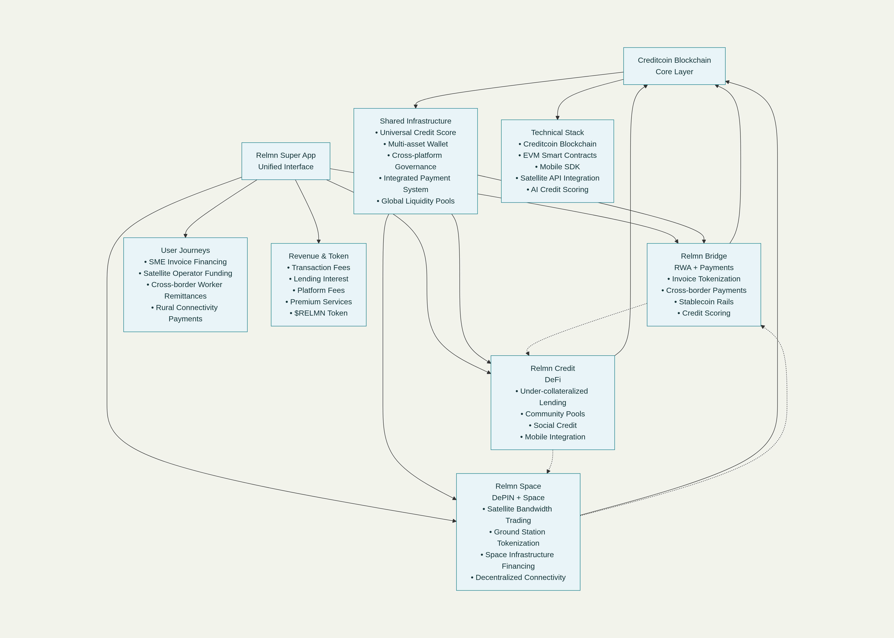

# Relmn

**Relmn** is a decentralized Web3 super app built on the Creditcoin blockchain, designed to connect relationships, money, and networks to empower global financial inclusion. It integrates real-world asset tokenization, decentralized finance (DeFi) lending, and decentralized physical infrastructure networks (DePIN) to deliver seamless, accessible financial services for underserved individuals, businesses, and communities worldwide.

---

## Table of Contents

- [Overview](#overview)
- [Features](#features)
- [Architecture](#architecture)
- [Getting Started](#getting-started)
- [Roadmap](#roadmap)
- [Tokenomics](#tokenomics)
- [Team](#team)
- [Contributing](#contributing)
- [License](#license)
- [Contact](#contact)

---

## Overview

Relmn is a unified platform that bridges fragmented financial ecosystems by offering:

- **Real World Asset (RWA) Tokenization:** Digitize invoices, receivables, and physical assets for improved liquidity.
- **DeFi Lending:** Under-collateralized loans backed by on-chain credit scoring and community liquidity pools.
- **DePIN Satellite Infrastructure:** Tokenized satellite bandwidth and infrastructure financing to expand connectivity.

Built with modularity, interoperability, and scalability in mind, Relmn targets emerging markets and the underbanked by providing mobile-first, trustless, and secure financial products.

---

## Features

### Relmn Bridge
- Invoice and asset tokenization as tradable tokens
- Stablecoin-based global payments with minimal fees
- AI-powered credit scoring from on-chain financial history

### Relmn Credit
- Community-backed, under-collateralized lending pools
- Social credit mechanisms and peer endorsements
- Mobile-first lending experience for emerging markets

### Relmn Space
- Marketplace for satellite bandwidth and ground station tokens
- Infrastructure financing powered by decentralized credit
- Incentivized decentralized physical infrastructure network (DePIN)

### Additional
- Multi-asset wallet managing native tokens and stablecoins
- Decentralized governance with the $RELMN token
- Built-in KYC/AML compliance layers integrated with Creditcoin

---

## Architecture

The platform is built on the Creditcoin blockchain as an EVM-compatible protocol. Core components include smart contracts for asset tokenization and lending, AI-driven credit scoring oracles, multi-asset wallet support, decentralized governance DAO, and satellite API integrations for DePIN.

---
For detailed dev docs, visit [docs.relmn.com](http://docs.relmn.com).
---

## Roadmap

- Q4 2025: Hackathon MVP launch  
- Q1 2026: Pilot deployment in Southeast Asia  
- Q2 2026: Beta release with full module integration  
- Q3 2026: Community governance launch  
- 2027: Global scaling and multi-chain support  

---

## Tokenomics

- **Token Name:** $RELMN  
- **Utility:** Governance, fee payment discounts, staking rewards, access to features  
- **Allocation:** Team (20%), Community (40%), Ecosystem (25%), Treasury (15%)  

---

## Team

- **Java Jay Bartolome** — Founder & CEO  
- Blockchain developers, product managers, AI specialists & business development spanning Asia-Pacific.

---

## License

This project is licensed under the MIT License. See [LICENSE](LICENSE) for details.

---

## Contact

- Website: [relmn.com](https://relmn.com)  
- Email: contact@relmn.com  
- Join our community on Slack and Telegram (links in website footer)  

---

*Relmn: Connecting the world through relationships, money, and networks.*

